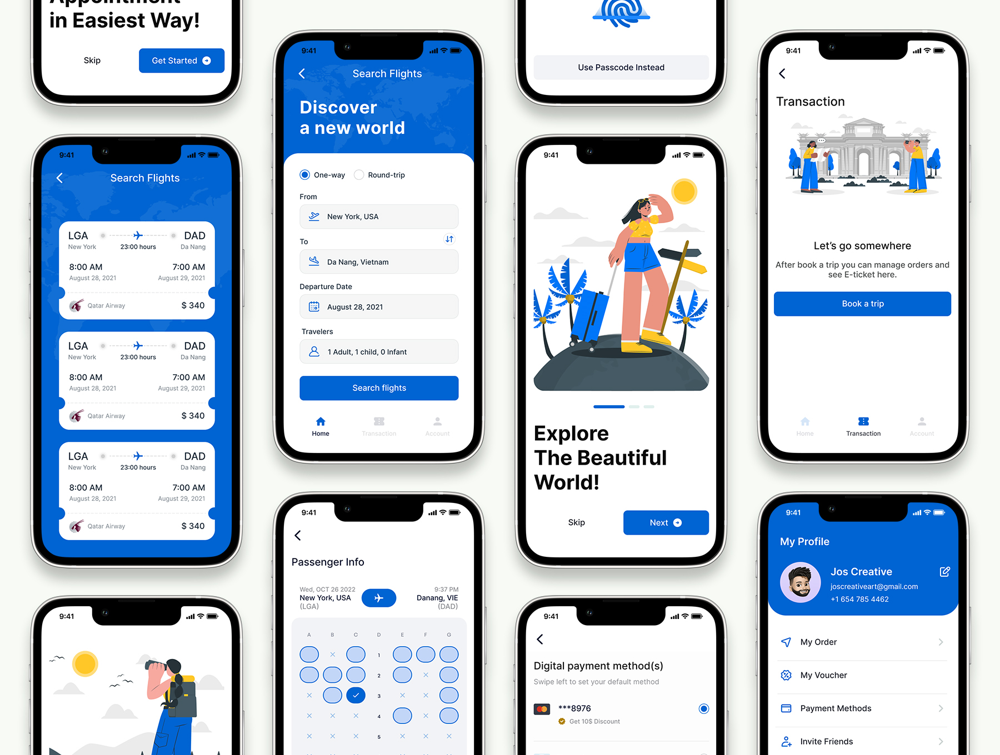
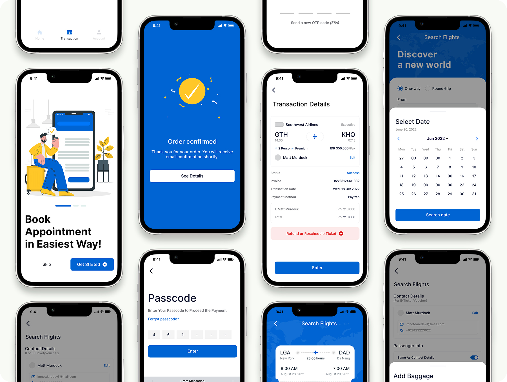
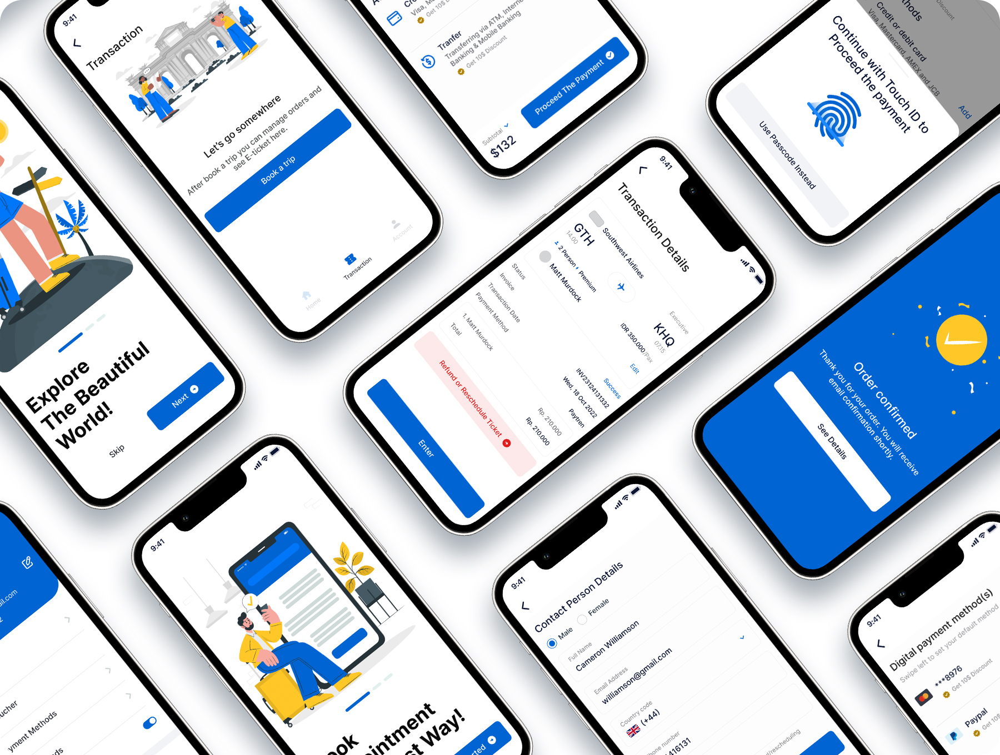
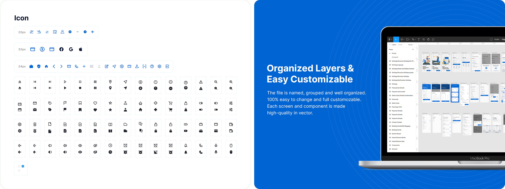
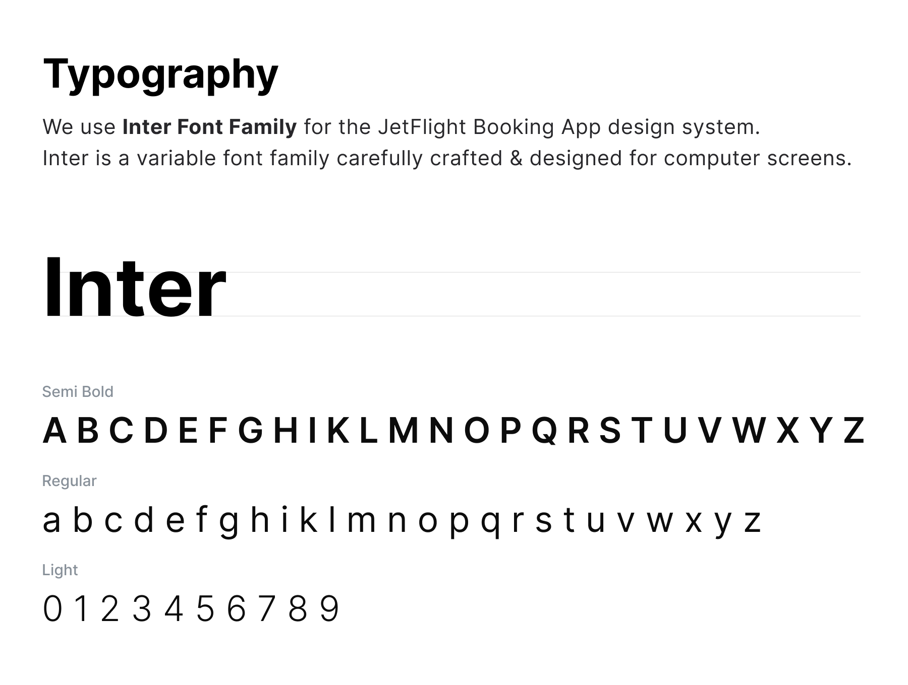
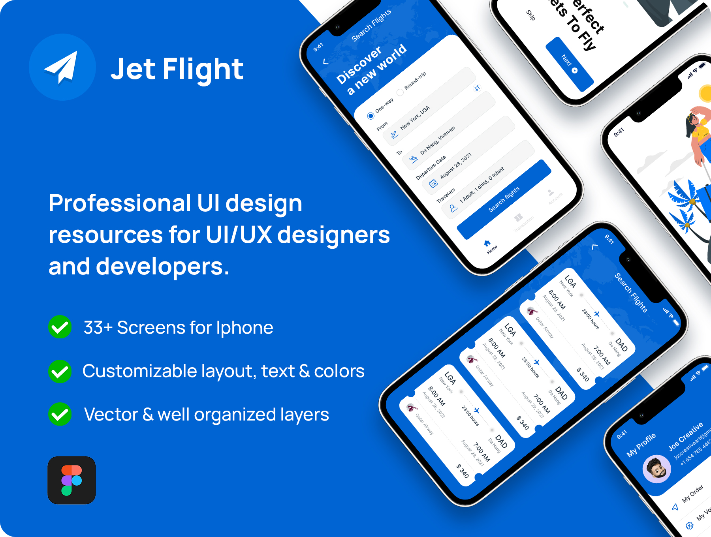

# React Native Airline App

JetFlight - is a React Native Flight Booking Mobile app beautifully crafted with modern and stylish look. Built with utmost care and perfection.

## Art Boards / Screens Included

There are in total 33+ screen files in this project:

- Sign In
- Sign Up
- Onboarding
- Smart Home
- Booking Form
- Choose Departure
- Ticket List
- Contact Detail
- Passenger Info
- Add Baggage
- Select Seat
- Modal Confirmation
- Account
- Settings
- Payment Details
- Transaction Details
- And much more

## Additional Features

- [Expo Router](https://docs.expo.dev/routing/introduction/) file-based navigation and API Routes
- [Reanimated](https://docs.swmansion.com/react-native-reanimated/) 3 for animations
- [GorhomSheet](https://gorhom.dev/react-native-bottom-sheet/) Modals & Bottom sheets

## Screenshots

